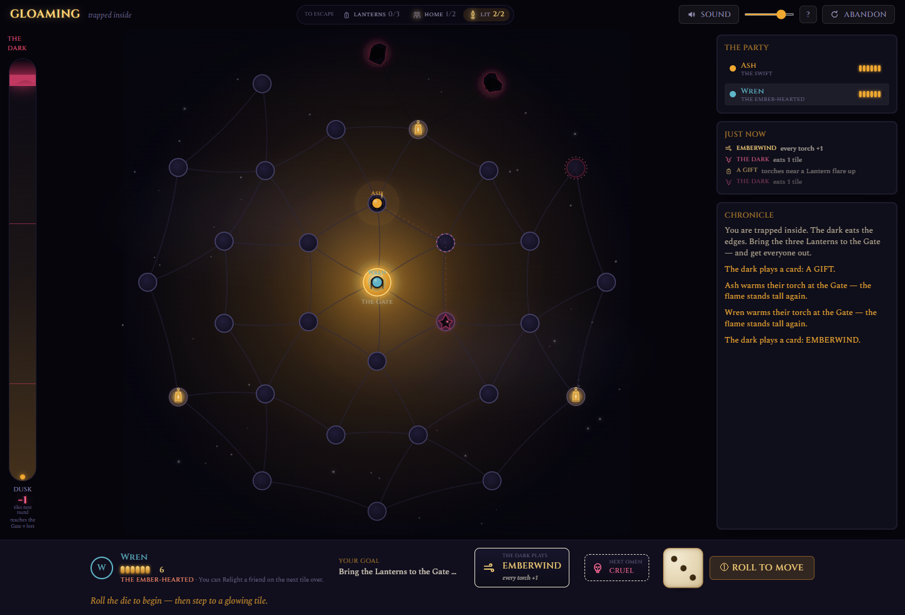
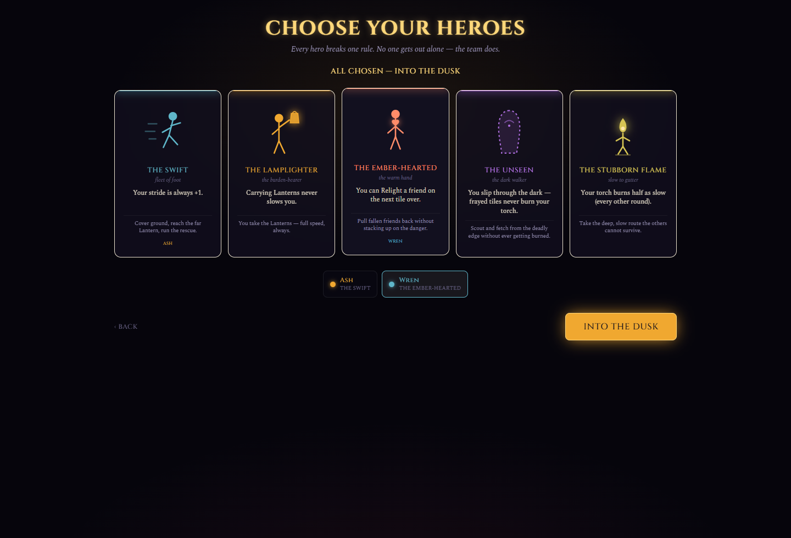
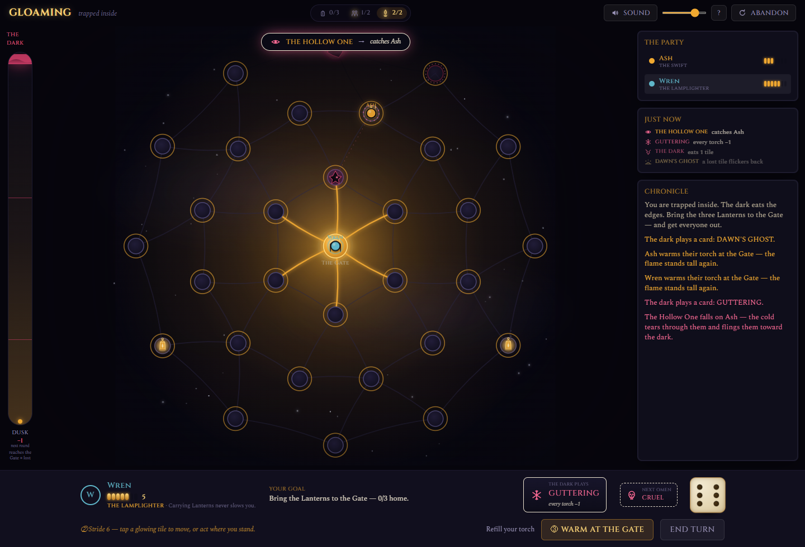
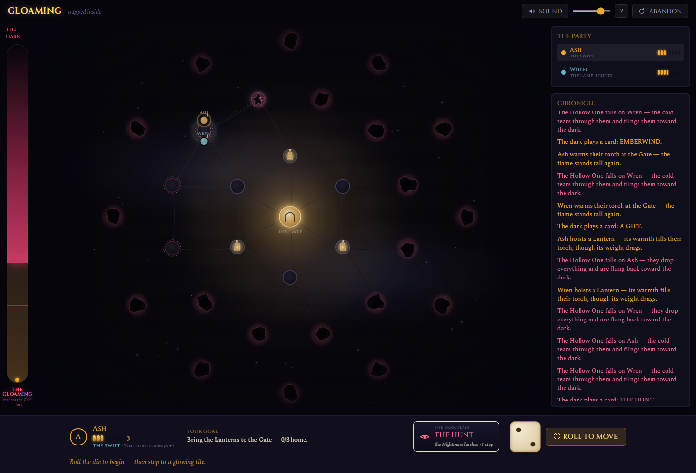

<div align="center">

# GLOAMING
### *Trapped Inside*

**You're trapped inside a board game, and the dark is eating it from the edges in.**
Grab the three Lanterns, carry them to the Gate, and get everyone out together —
before the dark reaches the middle. Don't let your torch go out. Don't get caught by the Hollow One. Don't leave anyone behind.

**▶ Play it live: https://gloaming-murex.vercel.app**

*2–6 players · pass-and-play · one device · no install · ~20–30 minutes · an SHV Studios production*



</div>

---

## What this is

A browser co-op board game where the board is a **living, adversarial thing you watch move.** It was
built, torn down, reconceived, and crowned across six sessions — and the interesting part isn't "an AI
made a game." It's the **method**: an AI directed like a studio, held to the bar *"a senior product
designer was paid ₹2 lakh and shipped this,"* with automated quality gates that prove the claims instead
of asserting them — including a bot that plays *smart* beating a bot that plays *greedy* by **+16 points**,
so we can prove the game rewards skill and isn't a dice roll.

## The six-session arc

| # | Session | What happened |
|---|---|---|
| S1–S2 | **Built** | A co-op "living board" on boardgame.io — single-resource engine, hidden-traitor scaffolding, an AI narrator. Technically sound. |
| S3–S4 | **Deepened** | Atmosphere, procedural sound, a telegraph→strike automa, a balanced ~50/50 fight. Everything ticked — and it played like **a spreadsheet in a horror skin.** |
| S5 | **Torn down → Reconceived** | The diagnosis: an *abstraction layer* sat between the player and the terror. Rebuilt from the root around one law — *the mechanic and the fantasy are the same thing.* The AI narrator was **deleted.** |
| **S6** | **Crowned** | The reconception was *loved* (a real player lost four straight and couldn't stop — *"kaise jeetun, kaise jeetun"*) but you'd win and not know *how.* S6 made it **causally legible**, gave every match a **story**, every player a **Hero**, crowned the villain, and **certified** it like a release. |

## Every rule is a thing you see

The reconception's binding law: **if a rule was a hidden number doing math, replace it with a thing that
moves, grows, shrinks, or gets eaten.** (Jumanji: you roll, a lion appears, you run — the rule *is* the
story, no layer between.)

| The old abstraction | The thing you now watch |
|---|---|
| A "Night" meter ticking toward a loss | **The dark eats the board.** Each round the outermost tiles turn to void; the ones fraying red go next — and the gauge tells you *exactly* how many fall next round. The island of light shrinks and herds everyone to the center. |
| An "Ember" currency draining | **A torch — a flame that burns down.** Refill it at a Lantern or the Gate. If it goes out you're a drifting **Wisp** until a friend relights you. |
| Beacon "progress" as a number | **Three Lanterns you physically carry.** Grab one (it fills your torch), carry it (you move one slower), deliver it to the Gate. Get caught and you drop it where you fall. |
| A "Stalker" stat advancing | **The Hollow One — a Nightmare that walks.** It steps toward the nearest torch and telegraphs its *whole route*; it evolves across the Acts; in the final act it hunts whoever carries a Lantern. The Gate is the one place it can't follow. |
| Paragraphs of AI narration | **Illustrated event cards** — an icon and three words that change the board. No reading. **No LLM.** |

## The crowning (Session 6) — five additive pillars

The reconception was *action*-legible (you always knew *what* you could do). It was not yet *causally*
legible (*why* did that happen; how close are we; what decision won it). Chess produces strategy because
the full state is visible **and every consequence is understood.** S6 closed that gap.

- **① Causal legibility.** Every change announces its **cause → effect** in-world: a beat banner ("THE
  HOLLOW ONE → catches Ash"), a turn-log strip, and an **Escape Checklist** always on screen — 🏮 Lanterns
  · 👥 everyone Home · 🔥 Torches Lit — so anyone can answer *"what do we still need?"* in half a second.
  When the third Lantern lands, **the Gate throws open** in a wash of light: the win-explainer you were missing.
- **② The Match Story.** Every game ends on a recap with a **named ending** — *Flawless Dawn · By a Breath
  · So Close · Swallowed* — an illustrated timeline of its key beats, the few numbers that matter, and, on
  a loss, **what killed the run** ("the 2nd Lantern fell on round 5 and was never carried back"). Losses
  become lessons; lessons become *one more game.*
- **③ The Heroes.** Each player picks a Hero with **one passive, rule-breaking line** — the Swift reaches
  further, the Lamplighter carries free, the Ember-Hearted relights across a tile, the Unseen walks the dark
  unburned, the Stubborn Flame guts out slower. No activation, no cooldown; zero rules-budget, huge strategy.
  No hero wins alone — the *team* does.
- **④ The Hollow One, crowned.** The villain evolves visibly (a shape in the fog → it wakes → it hunts),
  telegraphs its full path (and visibly *changes its mind* when it re-targets), and has a name.
- **⑤ The plannable future.** An honest dark forecast, the full Nightmare path, an **Omen** (the next
  card's *suit* — cruel/kind/wild — shown face-down), and a silent **what-if** on hover. A visible tomorrow
  is what strategy grows in.



## The Grandmaster proof — *skill is real, not luck*

The hard question for any game: does playing *well* actually win more, or is it a dice roll? We answer it
mechanically. A **smart bot** that plans a round ahead (reads the telegraph, protects the carrier, never
guts its torch, splits the work) is pitted against the **greedy bot** (a reasonable-but-careless player) on
*identical seeded games*, so the only variable is the decisions:

> **Skilled play beats careless play by +16 points at 2 players** (the most-played, most skill-intensive
> format), positive at every count, +9 overall. A full table forgives more — a real co-op truth — so the
> 4-player gap is smaller by design.

Getting there *drove the design*: it was flat until the fraying telegraph was made to genuinely cost torch
(reading it is now a skill) and the torch economy was tightened (managing it is now decisive). Strategy
isn't asserted; it's a passing test (`npm run grandmaster`).

## It teaches itself

No rulebook. A splash, a five-panel illustrated how-to, and a **scripted first turn** that coaches you
through your real first move: *roll → step to a glowing tile → grab the Lantern → watch the dark eat and
the Hollow One step → here's the checklist, that's how you leave.* The turn is a walker — **① Roll → ②
step to a gold tile → ③ one obvious button** — and a pure state machine guarantees the right controls at
the right moment (out-of-order input is *structurally impossible*; the reducer rejects it).

The objective test: a **Fresh-Eyes agent** shown only the screen, with no rules, must state what it can do
and why. It drove real fixes (the Escape Checklist counters got labels because a blind reviewer couldn't
decode them).



## The unfair advantage

A cardboard automa must stay brain-dead simple, because a human runs it by hand. **Ours runs on the
machine** — so the dark hunts with real cunning (the Hollow One paths to your most exposed torch; its pace
normalizes across player counts; delivered Lanterns hold it back near the Gate so the final gather stays
winnable) at **zero bookkeeping cost.** Night falls in three Acts — **Dusk → the Gloaming → Pitch** — read
straight off how deep the dark has eaten, each faster and hungrier, climaxing in a frantic dash.



## Proven, not asserted

Five automated gates run against the **real engine** before a human sits down:

- **The Referee** (`npm run referee`) — *the current player always has a legal action or the turn
  auto-resolves; never a softlock, never a crash* — with an assertion for **every** edge case (torch→0→Wisp,
  a Lantern on an eaten tile swept inward, the dark reaching the Gate, win-checked-before-loss, the
  Gate-is-sanctuary ward, hero edge cases, Pitch bearer-hunting can't strand the villain, the Gate opens
  exactly once, every Match-Story ending renders) **plus 150 chaos games at 2–6 players that all terminate.**
- **The Playtester** (`npm run playtest`) — hundreds of full games with random Heroes: **win-rate 45–55%
  per count · per-hero spread ≤ ±8 pts** (no mandatory pick, no trap pick) · **nail-biters ~70%+** · **0
  softlocks.**
- **The Grandmaster** (`npm run grandmaster`) — **smart ≥ greedy + 15 pts at 2p, positive everywhere.**
- **The UI-State contract** (`npm run uistate`) — 1,200+ turns assert the phase→controls contract and that
  the reducer enforces order. Button-sequence bugs are structurally impossible.
- **Zero console errors** — headless Chrome plays real turns and asserts a clean console, locally and on prod.

## Architecture

| Concern | Choice |
|---|---|
| Game engine | **[boardgame.io](https://boardgame.io)** — authoritative state, moves, turn flow. The world reacts in `turn.onEnd` via per-round accumulators normalized by player count, so pace is identical at every table size. |
| App | **Vite + React + TypeScript**, the board lazy-loaded behind the landing so it paints fast |
| Board | A **concentric-ring graph** — the geometry *is* the mechanic: the dark consumes the outermost surviving ring inward, and the Act is read from the deepest ring still alive |
| Style / motion / sound | **Tailwind v4** (one design-token file), **Framer Motion**, **Howler** — audio is 100% procedurally synthesised, zero asset files |
| Runtime AI | **None.** Fully self-contained — no LLM, no network, no secrets at runtime. Events are hand-authored illustrated cards. |
| Quality gates | `referee` · `playtest` · `grandmaster` · `uistate` · headless console check · `tsc` · Vite build |
| Deploy | **Vercel** (static) · **GitHub** via `gh` |

## Run it

```bash
npm install
npm run dev          # http://localhost:5173
npm run build        # production build
npm run typecheck    # tsc --noEmit

npm run referee      # turn-flow integrity — proves the game can never softlock or crash
npm run playtest     # headless balance sim (win-rate band, per-hero spread, nail-biters)
npm run grandmaster  # the skill-gap proof — smart bot vs greedy bot on identical seeded games
npm run uistate      # the interaction state-machine contract
```

No keys, no environment variables, no runtime services. It just runs.

## How it was built

Directed by **Shaurya Verma** and executed by **Claude Code (Opus 4.8)**, run as a literal studio: a
**research → plan → execute → review → ship** loop with a multi-lens **Council** critiquing every artifact —
**🎲 Game Designer · 🎨 Art Director · 🛠 Principal Engineer · ⚖️ Referee (automated) · 🎮 Playtester
(automated) · 🔍 Fresh-Eyes Teacher · ♟ Grandmaster (automated skill-gap) · 🏆 Certification** — findings
synthesized, fixed, and re-reviewed before anything shipped. Not an AI-slop generator: an AI *architect*
directing AI to hit a studio bar.

---

<div align="center"><sub>Grab the light. Get everyone out.</sub></div>
